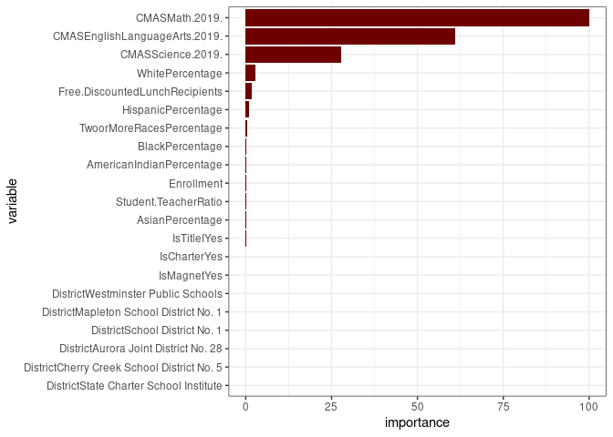

School Project\_Hu\&Shang
================
Ann Hu & Kexin Shang
14 Mar 2020

### Load Packages

``` r
library(tidyverse)
library(broom)
library(xlsx)
library(caret)
library(glmnet)
library(gbm)
library(GGally)
library(ranger)
library(rpart)
library(ggplot2)
library(nnet)
library(keras)
library(MASS)
theme_set(theme_bw()) #set ggplot as black and white
```

### Read School data and have an overview of the data

``` r
df <- read.xlsx("School.xlsx", sheetName = "Summary-nonzero")
p1 <- ggpairs(df)
# p1 <- ggpairs(df, upper = list(continuous = wrap("density", alpha = 0.5), combo = "box"),
#  lower = list(continuous = wrap("points", alpha = 0.3,    size=0.1), 
#               combo = wrap("dot", alpha = 0.4,            size=0.2)))
# p2 <- ggpairs(df, upper = list(continuous = wrap("points", alpha = 0.3,    size=0.1), 
#               combo = wrap("dot", alpha = 0.4,            size=0.2)),
#  lower = list(continuous = wrap("points", alpha = 0.3,    size=0.1), 
#               combo = wrap("dot", alpha = 0.4,            size=0.2)))
# #print(p1 + theme(strip.placement = "outside", text = element_text(size = 10)))
# #print(p1 + theme(strip.placement = "outside", text = element_text(size = new_size)))
# 
# p_cor <- set_panel_size(p2,
#                           width  = unit(10, "cm"),
#                           height = unit(4, "in"))
```

### Split data into training and testing

``` r
set.seed(2020)
inTraining <- caret::createDataPartition(df$Rating, 
                                         p = .8,
                                         list = F)
training <- df[inTraining, ]
testing  <- df[-inTraining, ]
```

### Multilinear Regression

``` r
lm_reg <- lm(Rating ~ ., data = training)
summary(lm_reg)
```

``` 

Call:
lm(formula = Rating ~ ., data = training)

Residuals:
     Min       1Q   Median       3Q      Max 
-17.3685  -1.7170   0.2164   2.2619   7.9127 

Coefficients:
                                             Estimate Std. Error t value
(Intercept)                                  5.686091  96.930994   0.059
DistrictAurora Joint District No. 28        -7.219165   6.188132  -1.167
DistrictCherry Creek School District No. 5 -15.239759   8.348801  -1.825
DistrictMapleton School District No. 1       0.594394   4.852680   0.122
DistrictSchool District No. 1                0.877770   3.384005   0.259
DistrictState Charter School Institute       4.437420   5.697023   0.779
DistrictWestminster Public Schools           0.724835   3.936298   0.184
IsCharterYes                                -0.361784   1.750080  -0.207
IsMagnetYes                                  2.392869   3.528883   0.678
IsTitleIYes                                 -9.009743   2.663900  -3.382
Enrollment                                   0.005425   0.003518   1.542
Student.TeacherRatio                        -0.336441   0.284389  -1.183
Free.DiscountedLunchRecipients              -2.355552   9.400538  -0.251
WhitePercentage                            -12.416768  95.097462  -0.131
BlackPercentage                             -9.115496  97.538840  -0.093
HispanicPercentage                          -5.015954  96.807392  -0.052
AsianPercentage                             -3.118610  99.247915  -0.031
AmericanIndianPercentage                   127.095169 134.903981   0.942
TwoorMoreRacesPercentage                    17.375274 105.441649   0.165
CMASEnglishLanguageArts.2019.                0.748941   0.100347   7.463
CMASMath.2019.                               0.633052   0.072501   8.732
CMASScience.2019.                           -0.067330   0.064162  -1.049
                                           Pr(>|t|)    
(Intercept)                                 0.95338    
DistrictAurora Joint District No. 28        0.24706    
DistrictCherry Creek School District No. 5  0.07192 .  
DistrictMapleton School District No. 1      0.90284    
DistrictSchool District No. 1               0.79605    
DistrictState Charter School Institute      0.43849    
DistrictWestminster Public Schools          0.85440    
IsCharterYes                                0.83679    
IsMagnetYes                                 0.49981    
IsTitleIYes                                 0.00115 ** 
Enrollment                                  0.12731    
Student.TeacherRatio                        0.24053    
Free.DiscountedLunchRecipients              0.80283    
WhitePercentage                             0.89647    
BlackPercentage                             0.92579    
HispanicPercentage                          0.95881    
AsianPercentage                             0.97502    
AmericanIndianPercentage                    0.34916    
TwoorMoreRacesPercentage                    0.86956    
CMASEnglishLanguageArts.2019.              1.24e-10 ***
CMASMath.2019.                             4.82e-13 ***
CMASScience.2019.                           0.29738    
---
Signif. codes:  0 '***' 0.001 '**' 0.01 '*' 0.05 '.' 0.1 ' ' 1

Residual standard error: 4.428 on 75 degrees of freedom
Multiple R-squared:  0.9824,    Adjusted R-squared:  0.9775 
F-statistic: 199.9 on 21 and 75 DF,  p-value: < 2.2e-16
```

### Multilinear Regression test MSE

``` r
test_preds <- predict(lm_reg, newdata = testing)
test_df <- testing %>%
  mutate(y_hat_lm = test_preds,
         sq_err_lm = (y_hat_lm - Rating)^2)
lm_MSE <- mean(test_df$sq_err_lm)
lm_MSE
```

    [1] 29.44135

### Lasso Model

``` r
#df <- read.xlsx("School.xlsx", sheetName = "Summary-nonzero")
x <- model.matrix(Rating ~ ., df)[, -1]
y <- df$Rating

#inTraining <- createDataPartition(df$Rating, 
#                                  p = .75,
#                                  list = F)

x_train <- x[inTraining, ]
x_test  <- x[-inTraining, ]

y_train <- y[inTraining]
y_test <- y[-inTraining]
```

### Find best lambda using CV for lasso

``` r
set.seed(2020)
lambdas <- 10^seq(-2, 5, len = 100)
lasso_mod <- glmnet(x_train, y_train, alpha = 1, lambda = lambdas)
lasso_cv <- cv.glmnet(x_train, y_train, alpha = 1, lambda = lambdas)
plot(lasso_cv)
```


### Find the test MSE and the predictor coefficients of Lasso Model

``` r
#lasso_MSE <- mean((predict(lasso_mod, s = lasso_cv$lambda.min, newx = x_test) - y_test)^2)
test_preds <- predict(lasso_mod, s = lasso_cv$lambda.min, newx = x_test)
test_df <- test_df %>%
  mutate(y_hat_lasso = test_preds,
         sq_err_lasso = (test_preds - Rating)^2)

lasso_full <- glmnet(x,y,alpha = 1)
coef_lasso <- coef(lasso_full,s = lasso_cv$lambda.min)
coef_lasso
```

``` 
22 x 1 sparse Matrix of class "dgCMatrix"
                                                     1
(Intercept)                                -3.09412349
DistrictAurora Joint District No. 28       -2.39551724
DistrictCherry Creek School District No. 5 -0.98634704
DistrictMapleton School District No. 1      .         
DistrictSchool District No. 1               0.06896466
DistrictState Charter School Institute      .         
DistrictWestminster Public Schools          .         
IsCharterYes                                .         
IsMagnetYes                                 .         
IsTitleIYes                                -6.44151126
Enrollment                                  .         
Student.TeacherRatio                        .         
Free.DiscountedLunchRecipients              .         
WhitePercentage                             4.55732116
BlackPercentage                            -0.06977237
HispanicPercentage                          .         
AsianPercentage                             .         
AmericanIndianPercentage                    .         
TwoorMoreRacesPercentage                    .         
CMASEnglishLanguageArts.2019.               0.65555637
CMASMath.2019.                              0.59346213
CMASScience.2019.                           .         
```

### Regression Tree

``` r
set.seed(2020)
#df <- read.xlsx("School.xlsx", sheetName = "Summary-nonzero")
#inTraining <- caret::createDataPartition(df$Rating, 
#                                         p = .75,
#                                         list = F)
#training <- df[inTraining, ]
#testing  <- df[-inTraining, ]
train_control <- trainControl(method = "repeatedcv",
                            number = 10, 
                            repeats = 5)
tune_grid <- data.frame(maxdepth = 1:10) #num of branches
regTree <- train(Rating ~ ., 
                        data = training,
                        method = "rpart2", 
                        trControl = train_control,
                        tuneGrid = tune_grid)
plot(regTree)
```


### Test MSE of Regression tree using branches = 4

``` r
test_preds <- predict(regTree, newdata = testing)
test_df <- test_df %>%
  mutate(y_hat_regTree = test_preds,
         sq_err_regTree = (test_preds - Rating)^2)
regTree_MSE <- mean(test_df$sq_err_regTree)
regTree_MSE
```

    [1] 77.52859

### Random Forest

``` r
set.seed(2020)
tune_grid <- expand.grid(mtry = 1:16,
                        splitrule = "variance",
                        min.node.size = 10)
train_control <- trainControl(method = "cv", number = 10)
rf <- train(Rating ~ .,
                    data = training,
                    method = "ranger",
                    num.trees = 500,
                    importance = "impurity",
                    trControl = train_control,
                    tuneGrid = tune_grid)
plot(rf)
```


### Test MSE of Random Forest

``` r
test_preds <- predict(rf, newdata = testing)
test_df <- test_df %>%
  mutate(y_hat_rf = test_preds,
         sq_err_rf = (test_preds - Rating)^2)
rf_MSE <- mean(test_df$sq_err_rf)
rf_MSE
```

    [1] 7.649194

### Important variables selected by random forest

``` r
imp <- varImp(rf)$importance
rn <- row.names(imp)
imp_df <- data_frame(variable = rn,
                      importance = imp$Overall) %>%
  arrange(desc(-importance)) %>%
  mutate(variable = factor(variable, variable))
p <- ggplot(data = imp_df,
            aes(variable, importance))
p + geom_col(fill = "#6e0000") +
coord_flip()
```



### Gradient Boosting

``` r
set.seed(2020)
grid <- expand.grid(interaction.depth = c(1:10), #how many branches in the tree
                    n.trees = seq(100, 2000, by = 100),
                    shrinkage = c(.01, 0.001),
                    n.minobsinnode = 10)

trainControl <- trainControl(method = "cv", number = 5)

gbm <- train(Rating ~ ., 
                    data = training, 
                    distribution = "gaussian", 
                    method = "gbm",
                    trControl = trainControl, 
                    tuneGrid = grid,
                    verbose = FALSE)
plot(gbm)
```


### Test MSE of Gradient Boosting

``` r
test_preds <- predict(gbm, newdata = testing)
test_df <- test_df %>%
  mutate(y_hat_gbm = test_preds,
         sq_err_gbm = (test_preds - Rating)^2)
gbm_MSE <- mean(test_df$sq_err_gbm)
gbm_MSE
```

    [1] 10.86076

### Important variables selected by Gradient Boosting

``` r
imp <- varImp(gbm)$importance
rn <- row.names(imp)
imp_df <- data_frame(variable = rn, 
                     importance = imp$Overall) %>%
  arrange(desc(-importance)) %>%
  mutate(variable = factor(variable, variable))
p <- ggplot(data = imp_df,
            aes(variable, importance))
p + geom_col(fill = "#6e0000") +
  coord_flip()
```


### Nerual Network

``` r
set.seed(2020)
tune_grid <- expand.grid(size = 1:8,
                         decay = 10^seq(-4, -2, len=6))

fit_control <- trainControl(method = "cv",
                           number = 10)

nn_train<- train(Rating ~ .,
                         data = training,
                         method = "nnet",
                         tuneGrid = tune_grid,
                         trControl = fit_control,
                         maxit = 500,
                         linout = TRUE,
                         verbose = FALSE,
                         trace = FALSE)
```

``` r
nn_train
```

    Neural Network 
    
    97 samples
    16 predictors
    
    No pre-processing
    Resampling: Cross-Validated (10 fold) 
    Summary of sample sizes: 89, 86, 86, 88, 87, 88, ... 
    Resampling results across tuning parameters:
    
      size  decay         RMSE       Rsquared   MAE      
      1     0.0001000000  28.903072        NaN  24.722599
      1     0.0002511886  28.903062        NaN  24.722538
      1     0.0006309573  28.575985  0.4384921  23.949187
      1     0.0015848932  24.402605  0.8591311  20.553926
      1     0.0039810717  28.903071        NaN  24.722247
      1     0.0100000000  11.907528  0.7926862   9.760794
      2     0.0001000000  25.911612  0.9942726  22.233954
      2     0.0002511886  26.092533  0.9922734  22.403192
      2     0.0006309573  26.778323  0.9898933  22.878623
      2     0.0015848932  22.680334  0.8691545  19.413252
      2     0.0039810717  23.832032  0.9818889  20.066167
      2     0.0100000000   5.136613  0.9519417   3.715218
      3     0.0001000000  28.684517  0.3261866  24.052986
      3     0.0002511886  28.809601        NaN  24.566876
      3     0.0006309573  28.903069  0.1565961  24.722577
      3     0.0015848932  21.619078  0.6701454  18.210699
      3     0.0039810717  25.644566  0.6760349  21.560824
      3     0.0100000000   7.546671  0.9252001   5.810186
      4     0.0001000000  26.191791  0.4524349  22.109041
      4     0.0002511886  24.132105  0.9846641  20.469283
      4     0.0006309573  29.011666        NaN  24.684536
      4     0.0015848932  21.038537  0.9941790  17.994526
      4     0.0039810717   6.741231  0.8996562   5.582062
      4     0.0100000000   5.534216  0.9010049   4.084982
      5     0.0001000000  27.138916  0.4290991  22.886516
      5     0.0002511886  23.913684  0.6637604  19.602929
      5     0.0006309573  26.736710  0.9438646  22.890260
      5     0.0015848932  24.287097  0.9785474  20.740926
      5     0.0039810717   9.846531  0.9752221   7.792473
      5     0.0100000000   4.463032  0.9681970   3.247101
      6     0.0001000000  26.098914  0.5737914  22.397273
      6     0.0002511886  27.642975  0.6222410  23.449155
      6     0.0006309573  28.893169  0.4244690  24.691005
      6     0.0015848932  15.237523  0.9917990  13.110222
      6     0.0039810717   7.350448  0.9403741   5.719961
      6     0.0100000000   5.320150  0.9684638   3.811314
      7     0.0001000000  24.573594  0.5726075  20.174422
      7     0.0002511886  27.544367  0.5591208  22.681505
      7     0.0006309573  18.825797  0.8720423  15.641473
      7     0.0015848932  24.336708  0.9755195  20.618468
      7     0.0039810717   3.388045  0.9814750   2.704009
      7     0.0100000000   5.616720  0.9640205   4.327858
      8     0.0001000000  25.846097  0.9858902  22.081128
      8     0.0002511886  26.234362  0.9451872  22.332392
      8     0.0006309573  22.392065  0.9601263  19.004178
      8     0.0015848932  24.564947  0.9725253  20.824681
      8     0.0039810717   6.856435  0.9338282   5.156626
      8     0.0100000000   3.840780  0.9768783   2.876336
    
    RMSE was used to select the optimal model using the smallest value.
    The final values used for the model were size = 7 and decay = 0.003981072.

``` r
nn <- nnet(Rating ~ .,
                     data = training,
                     size =7,
                     decay = 0.003981072,
                     linout = TRUE,
                     maxit = 500,
                     trace = FALSE)
```

### Test MSE of Netural Nets

``` r
test_preds <- predict(nn, newdata = testing)
test_df <- test_df %>%
  mutate(y_hat_nn = test_preds,
         sq_err_nn = (test_preds - Rating)^2)
nn_MSE <- mean(test_df$sq_err_nn)
nn_MSE
```

    [1] 9.237349

### Deep Learning

``` r
x_train <- df[inTraining, ] %>%
  dplyr::select(-Rating)
x_test  <- df[-inTraining, ] %>%
  dplyr::select(-Rating)
y_train <- df[inTraining, ] %>%
  dplyr::select(Rating) %>%
  .[[1]]    
y_test <- df[-inTraining, ] %>%
  dplyr::select(Rating) %>%
  .[[1]]
#avg <- apply(x_train, 2, mean)
#std_dev <- apply(x_train, 2, sd)
#x_train <- scale(x_train, center = avg, scale = std_dev)
#x_test <- scale(x_test, center = avg, scale = std_dev)
```

``` r
network <- keras_model_sequential() %>%
  layer_dense(units = 64,
              activation = "relu",
              input_shape = dim(x_train)[[2]]) %>%
  layer_dense(units = 32, activation = "relu") %>%
  layer_dense(units = 1)

network %>%
  compile(optimizer = "rmsprop",
          loss = "mse",
          metrics = c("mae"))
```

``` r
network %>%
  fit(data.matrix(x_train), 
      y_train, 
      epochs = 50, 
      batch_size=10, 
      verbose = 1)
```

### Find the best number of epochs through cv

``` r
build_network <- function(){
  network <- keras_model_sequential() %>%
    layer_dense(units = 64,
                activation = "relu",
                input_shape = dim(x_train)[[2]]) %>%
    layer_dense(units = 32, activation = "relu") %>%
    layer_dense(units = 1)
  
  network %>% compile(
  optimizer = "rmsprop",
  loss = "mse",
  metrics = c("mae")
  )
}
```

``` r
set.seed(2020)
k <- 10
indices <- sample(1:y_train, replace = F)
folds <- cut(indices, breaks = k, labels = F)

num_epochs <- 100
accuracy_histories <- matrix(NA, nc = num_epochs, nr = k)

for(i in 1:k){
  # i <- 1
  cat(sprintf('\nProcessing Fold: %s at %s\n', i, Sys.time()))
  val_index <- which(folds == i, arr.ind = TRUE)
  x_val <- data.matrix(x_train[val_index, ])
  y_val <- y_train[val_index]
  x_train_sub <- data.matrix(x_train[-val_index, ])
  y_train_sub <- y_train[-val_index]
  model <- build_network()
  history <- model %>% fit(x_train_sub, 
                           y_train_sub, 
                           epochs = num_epochs, 
                           batch_size = 20,
                           verbose = 0,
                           validation_data = list(x_val, y_val)) 
  # results <- history$metrics$val_loss
  accuracy_histories[i, ] <- history$metrics$val_loss
} 
```

``` 

Processing Fold: 1 at 2020-03-14 03:13:18

Processing Fold: 2 at 2020-03-14 03:13:20

Processing Fold: 3 at 2020-03-14 03:13:23

Processing Fold: 4 at 2020-03-14 03:13:25

Processing Fold: 5 at 2020-03-14 03:13:27

Processing Fold: 6 at 2020-03-14 03:13:30

Processing Fold: 7 at 2020-03-14 03:13:32

Processing Fold: 8 at 2020-03-14 03:13:35

Processing Fold: 9 at 2020-03-14 03:13:38

Processing Fold: 10 at 2020-03-14 03:13:40
```

``` r
avg_accuracy <- tibble(epoch = 1:num_epochs,
                       mse = apply(accuracy_histories, 2, mean))
p <- ggplot(data = avg_accuracy,
            aes(x = epoch, y = mse))
p + geom_point() +
  geom_line() + 
  ylim(0, 50) +
  geom_smooth() +
  theme_bw()
```


``` r
bestEpoch <- avg_accuracy[avg_accuracy$mse == min(avg_accuracy$mse),"epoch"]
bestEpoch
```

    # A tibble: 1 x 1
      epoch
      <int>
    1    91

``` r
network <- build_network()

network %>% fit(data.matrix(x_train), 
                y_train, 
                epochs = 97, 
                batch_size = 20,
                verbose = 1,
                validation_data = list(data.matrix(x_test), y_test))
```

### Test MSE of deep network

``` r
test_preds <- network %>%
  predict(data.matrix(x_test))
test_df <- test_df %>%
  mutate(y_hat_deep = test_preds,
         sq_err_deep = (test_preds - Rating)^2)
deep_MSE <- mean(test_df$sq_err_deep)
deep_MSE
```

    [1] 22.82526

# Compare all the models

``` r
p_yhat <- dplyr::select(test_df, Rating, y_hat_lm, y_hat_lasso, y_hat_regTree, 
                   y_hat_rf, y_hat_gbm, y_hat_nn, y_hat_deep) %>%
  tidyr::gather(method, prediction) %>%
  ggplot(aes(prediction, fill = method))
p_yhat + geom_density(alpha = .2) +
  facet_wrap(~ method) +
  scale_fill_brewer(palette = "Dark2")
```


``` r
p_sqerr <- dplyr::select(test_df, Rating, sq_err_lm, sq_err_lasso, sq_err_regTree, 
                   sq_err_rf, sq_err_gbm, sq_err_nn, sq_err_deep) %>%
  tidyr::gather(method, sq_err) %>%
  ggplot(aes(sq_err, fill = method))
p_sqerr + geom_density(alpha = .2) +
  scale_x_continuous("squared error", limits = c(0, 50)) +
  scale_fill_brewer(palette = "Dark2",
                    labels = c("Rating", "lm", "lasso" , "tree", "rf", "gbm", "nn", "deep")) 
```


``` r
dfsqerr <- data.frame(p_sqerr$data)
TestMSE <- dfsqerr %>% 
  dplyr::group_by(method) %>%
  dplyr::summarize(err_mean = mean(sq_err),     
                   err_std = sd(sq_err))
TestMSE
```

    # A tibble: 8 x 3
      method         err_mean err_std
      <chr>             <dbl>   <dbl>
    1 Rating            38.7     32.2
    2 sq_err_deep       22.8     17.2
    3 sq_err_gbm        10.9     12.0
    4 sq_err_lasso      14.0     21.2
    5 sq_err_lm         29.4     61.9
    6 sq_err_nn          9.24    20.2
    7 sq_err_regTree    77.5    151. 
    8 sq_err_rf          7.65    10.3
